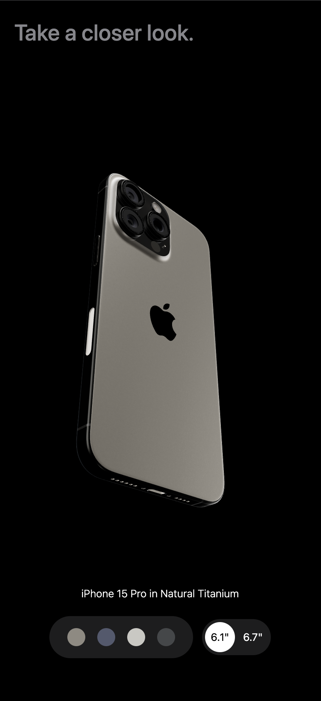

# Apple iPhone 15 Pro Website Clone

Fully responsive website clone using customised GSAP animations and Three.js 3D effects. 

Use the app [here](https://bright-gelato-d9b778.netlify.app)

# Description
This is a clone of Apple's iPhone 15 Pro website using React.js and TailwindCSS. It utilises GSAP (Greensock Animations) to animate various sections of the website including images and text. It also uses Three.js to display the iPhone 15 Pro models in various colors and shapes and allow the user to manipulate them.

# Take a Look at the Website

## Desktop:

<kbd>

</kbd>

## Mobile:

<kbd>

</kbd>

# Tools Used
* React.js
* Three.js
* React Three Fiber
* React Three Drei
* GSAP (Greensock)
* Vite
* Tailwind CSS
