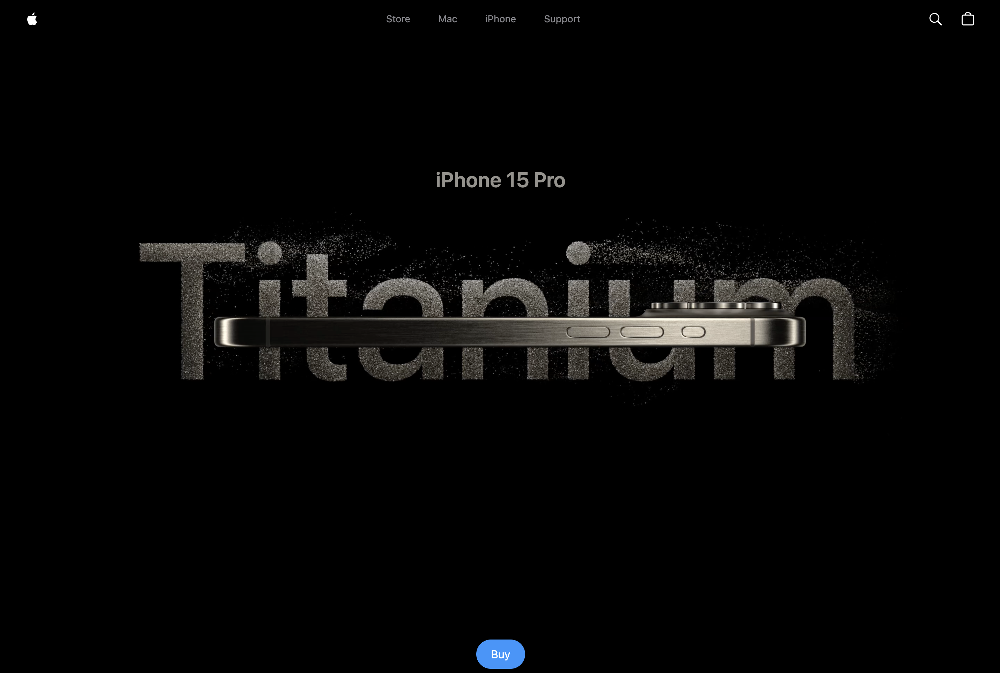

# Apple iPhone 15 Pro Website Clone

Fully responsive website clone using customised GSAP animations and Three.js 3D effects. 

See the website [here](https://bright-gelato-d9b778.netlify.app)

# Description
This is a clone of Apple's iPhone 15 Pro website using React.js and Tailwind CSS. It utilises GSAP (Greensock Animations) to animate various sections of the website including videos, images and text. It also uses Three.js to display the iPhone 15 Pro models in different colors and sizes and allows the user to manipulate them in real time.

# Take a Look at the Website

## Desktop:

<kbd>

</kbd>

## Mobile:

<kbd>

</kbd>

<kbd>

</kbd>

<kbd>

</kbd>

# Tools Used
* React.js
* Three.js
* React Three Fiber
* React Three Drei
* GSAP (Greensock)
* Vite
* Tailwind CSS
* Netlify (free hosting)
